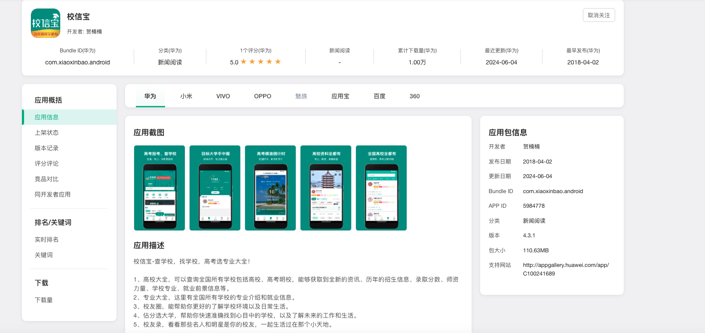

# 校信宝

⚠️ **注意：校信宝是非开源项目，本仓库仅用来管理需求和用户反馈。**

[校信宝](https://henannan.com/)是一款高考志愿填报工具。校信宝具有全平台、免费查、数据准、无骚扰等优点，理念是让高考报考更精准、方便，助力学生和家长找到心仪的学校和专业！现已支持Windows、Mac、Android和iOS四大平台。

官方网站：https://henannan.com

## 校信宝是什么？

**校信宝 = 填报技巧 + 专业介绍 + 院校规划**

校信宝大数据采集录取分数、位次、招生计划、就业数据，并深度整合，一个工具顶多个志愿规划师。校信宝基于Flutter和C++开发，相比同类产品具有极大的成本优势。

*以上数据是在MacBook Pro 2017设备上测试，启动时间是通过录屏后计算帧差得出，内存使用为应用启动后直接置于后台再计算得出。*

#### 院校专业库

校信宝采用大数据动态抓取高校公开数据，支持查学校、专业各种详细数据。

- [x] 支持全国高校2024所专业、院系数据。
- [x] 支持HTTP/HTTPS/Socks4/Socks4a/Socks5代理方式。
- [x] 支持HTTPS，TLSv1.1、TLSv1.2和TLSv1.3加密协议。

实测截图：

### 专业录取分数线

校信宝通过大数据抓取以及人工二次多平台数据比对，让专业录取数据更加真实有效。

- [x] 支持HTTP/1.1, HTTP2和HTTP3(QUIC)协议。
- [x] API集合：支持创建创建集合目录保存和管理API，

实测截图：

## 下载和安装

校信宝官网提供了最新版本的下载：[点我查看](https://henannan.com)。如果希望下载历史版本：[点击这里](https://github.com/reqable/reqable-app/releases)。

### Windows安装

在Windows上，您下载的是`Setup.exe`，按照Setup安装程序指引即可。

### Mac安装

在Mac设备上，校信宝提供了Apple芯片和Intel芯片两种架构的安装包。您可以在AppStore 直接搜索【校信宝】下载并安装 
## 移动端支持

校信宝移动端支持单独使用，也支持与桌面端协同使用。

您可以从Play Store和App Store免费获取应用。

*移动端支持桌面端绝大多数功能。*

## 使用文档
https://xiaoxinbao.com/

## 致谢
- [reqable-app](https://github.com/reqable/reqable-app)

## 交流反馈

加我微信，拉你进群。

